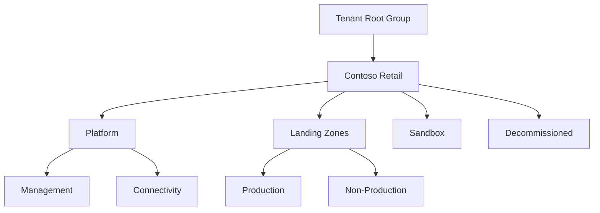

# ADR-0001: Management Group Hierarchy

- **Status:** Accepted
- **Date:** 2026-09-18
- **CAF phase:** Ready

## Context

Contoso Retail needs an Azure management group hierarchy that supports centralized governance while preserving application team autonomy. The company currently has three representative workloads across development, test, and production environments, and expects the number of workloads and subscriptions to grow.

The hierarchy must:

- Separate shared platform services from application workloads.
- Separate production from non-production governance.
- Provide scopes for inherited Azure Policy and RBAC assignments.
- Support sandbox and subscription decommissioning processes.
- Remain simple enough for the current organization while allowing future growth.

This decision is based on the requirements in `docs/company.md`, particularly sections 5-10, 14-16, and 21.

## Decision

Contoso Retail will use the following management group hierarchy:

The management groups have the following purposes:

| Management group | Purpose |
|---|---|
| `Contoso Retail` | Organization-wide governance scope and parent for all Contoso subscriptions. |
| `Platform` | Shared services owned by the platform engineering team. |
| `Management` | Central monitoring, logging, and management services. |
| `Connectivity` | Central networking, DNS, firewall, and future corporate connectivity services. |
| `Landing Zones` | Parent scope for application workload subscriptions. |
| `Production` | Production workload subscriptions requiring stronger governance and access controls. |
| `Non-Production` | Development and test workload subscriptions with shared governance characteristics. |
| `Sandbox` | Isolated experimentation and learning subscriptions. |
| `Decommissioned` | Quarantine for subscriptions awaiting cancellation. |

No management groups will be created per application team, workload, or external partner. These boundaries will be handled through subscriptions and RBAC. An `Identity` platform management group will not be created until dedicated subscription-based identity resources justify it.

### Azure Policy assignment scopes

- Organization-wide baseline policies will be assigned at `Contoso Retail` and inherited by its descendants.
- Purpose-specific policies will be assigned at `Platform`, `Production`, `Non-Production`, `Sandbox`, and `Decommissioned`.
- Production will receive stronger controls than non-production.
- Sandbox will retain the minimum company baseline while permitting controlled experimentation.
- Decommissioned will prevent new resource deployments.
- Specific policy definitions, initiatives, effects, exemptions, and rollout stages will be decided in ADR-0003.

### RBAC assignment scopes

- The platform engineering team will manage the `Platform` branch and its subscriptions.
- Application teams will receive access to their own workload subscriptions or resource groups, not to the complete `Production` or `Non-Production` management groups.
- Production access will be more restrictive than non-production access.
- The security team will receive organization-wide visibility appropriate to its monitoring and review responsibilities.
- Tenant Root Group access will be limited to exceptional hierarchy administration and emergency procedures.
- Specific Microsoft Entra ID groups, Azure roles, privileged access workflows, and service desk permissions will be decided in ADR-0004.

### Subscription lifecycle

- Sandbox subscriptions will be isolated from production and corporate networks, will not contain production data, and will use cost and lifecycle controls.
- Subscriptions being retired will move to `Decommissioned`, where new deployments are blocked while required data and logs are retained or exported before cancellation.

### Growth model

New workloads will place their subscriptions under the existing `Production` and `Non-Production` management groups. A new management group will be introduced only when a group of subscriptions requires materially different policy, access, security, or connectivity controls.

## Consequences

### Positive

- Platform services and application workloads have clear ownership boundaries.
- Production and non-production controls can differ without duplicating the complete hierarchy.
- Common policies and security visibility can be inherited from the organization scope.
- New workloads can be onboarded without redesigning the hierarchy.
- The structure follows Cloud Adoption Framework principles without introducing the full complexity of an enterprise-scale hierarchy.

### Negative

- Development and test cannot receive different management-group-level policies without adding another level later.
- Policy and RBAC inheritance must be tested carefully to avoid blocking valid platform services or granting overly broad access.
- Empty `Sandbox` and `Decommissioned` branches add small initial administrative overhead.

## Alternatives Considered

### Separate management groups for development and test

Rejected for the initial design because the company states that development and test may share governance and connectivity characteristics. They can still use separate subscriptions.

### Management groups per workload or application team

Rejected because team and workload boundaries are better represented by subscriptions and RBAC. Per-workload management groups would increase complexity as the portfolio grows.

### Full Cloud Adoption Framework enterprise-scale hierarchy

Rejected for the initial iteration because Contoso does not currently require regulated, sovereign, or complex enterprise-scale branches. The selected hierarchy can be extended if those requirements emerge.

### Dedicated external partner branch

Rejected because no requirement currently grants partners independent subscriptions or distinct governance. Partner access will be handled through RBAC when needed.

## Follow-up Decisions

- ADR-0002 will define the subscription organization model.
- ADR-0003 will define the Azure Policy baseline.
- ADR-0004 will define the platform RBAC and privileged access model.
